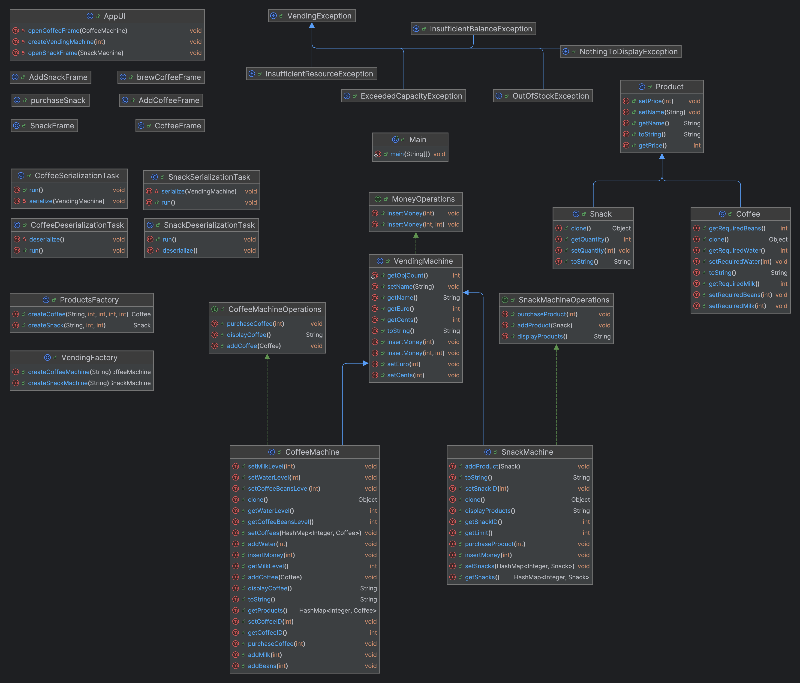

# Vending Machine project

### Author: Leonardas Sinkevičius  

### Purpose 
The purpose of project is to simulate work of an Vending machine with 2 possible variants (Coffee machine and Snack machine).

### Usage
To use this program complete folowing steps:
- Download this repository.
- In terminal navigate to the /Project folder.
- Use `java -jar Vending.jar` in terminal to start program.

### Functionality
In this project for both Snack and Coffee machines there are following available actions:
- Create a machine
- Add new product
- Purchase product
- Add resources (money, milk, water and coffee beans)
- Serialize data
- Deserialize data

### Possible modifications
It would be great to modify program by better UI, add error messages, add more types of different vending machines and products. If we want to use this code in real life scenarios it would be great to implement possibility to pay with card. 

### Main classes
- VendingMachine
- Product
- AppUI

### Factory design pattern
Factory design pattern used to create VendingFactory and ProductFactory classes, that are able to create new product or vending machine objects.

### UML class diagram

